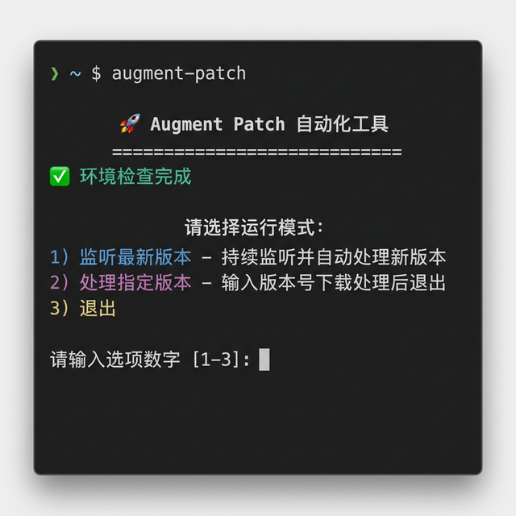
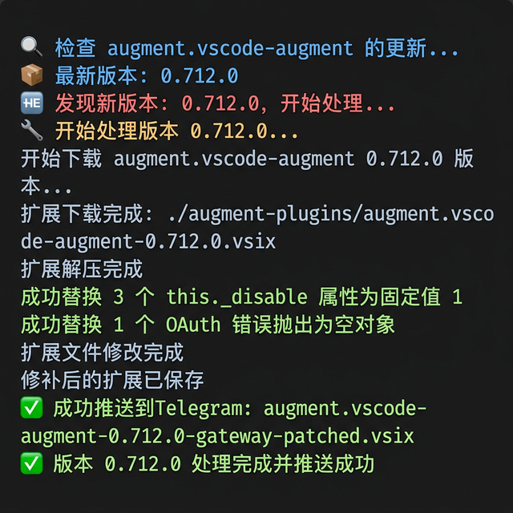
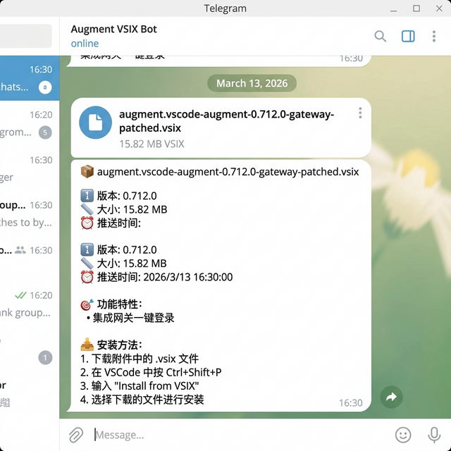
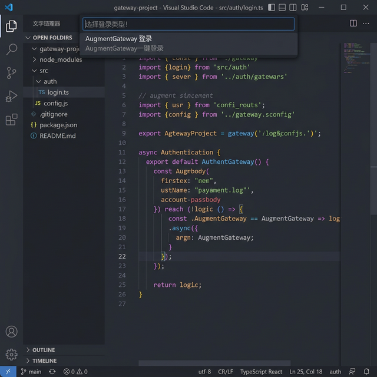

# Augment VSCode Plugin Auto-Patch Tool

English | [中文](./README.md)

An automation tool for monitoring Augment VSCode plugin updates, automatically downloading, patching, and pushing to a Telegram bot. Please use this plugin with: [Augment-Open-Gateway](https://github.com/linqiu919/augment-open-gateway) service!

## Features

- 🔄 **Auto Monitoring**: Checks for new plugin versions every hour
- 🛠️ **Auto Processing**: Automatically downloads, extracts, injects, and repackages
- 📱 **Telegram Push**: Automatically pushes processed files to a Telegram bot
- 📊 **Version Management**: Smart version tracking and history
- 🧹 **Auto Cleanup**: Automatically cleans up old version files
- ⚡ **Real-time Notifications**: Real-time processing status updates

## Screenshots

<table>
  <tr>
    <td align="center"><b>Startup Menu</b><br/></td>
    <td align="center"><b>Patch Processing</b><br/></td>
  </tr>
  <tr>
    <td align="center"><b>Telegram Push Notification</b><br/></td>
    <td align="center"><b>VSCode Final Result</b><br/></td>
  </tr>
</table>

## Install Dependencies

```bash
npm install
```

## Configure Environment Variables

1. Copy the environment variable template:
```bash
cp .env.example .env
```

2. Edit the `.env` file and fill in the required configuration:

```env
# Telegram bot configuration
TELEGRAM_BOT_TOKEN=your_bot_token_here
TELEGRAM_CHAT_ID=your_chat_id_here

# Check interval (minutes)
CHECK_INTERVAL_MINUTES=60

# Plugin configuration
PUBLISHER=augment
EXTENSION=vscode-augment

# Working directory
WORK_DIR=./augment-plugins

# Enable auto cleanup
AUTO_CLEANUP=true

# Number of versions to keep (recommended: 1, keep only the latest)
KEEP_VERSIONS=1
```

### Getting Telegram Configuration

1. **Create a bot**:
   - Search for `@BotFather` on Telegram
   - Send `/newbot` to create a new bot
   - Follow the prompts to set the bot name and username
   - Get the `TELEGRAM_BOT_TOKEN`

2. **Get Chat ID**:
   - Add the bot to the target group or channel
   - Send a message to the bot
   - Visit `https://api.telegram.org/bot<YOUR_BOT_TOKEN>/getUpdates`
   - Find `chat.id` in the returned JSON

## Usage

### Using the Startup Script (Recommended)

The project provides an interactive startup script `start.sh` that automatically performs environment checks and provides a convenient operation menu.

```bash
# Add execute permission (first time only)
chmod +x start.sh

# Run the startup script
./start.sh
```

After starting, the script automatically performs the following checks:
- ✅ Checks if Node.js and npm are installed
- ✅ Checks if the `.env` config file exists (auto-copies from `.env.example` if not)
- ✅ Checks if `node_modules` dependencies are installed (auto-runs `npm install` if not)
- ✅ Checks if `inject.txt` injection code file exists
- ✅ Automatically creates the `augment-plugins` working directory

After passing the environment checks, the script displays an interactive menu:

```
Select run mode:
  1) Watch latest version - Continuously monitor and auto-process new versions
  2) Process specific version - Enter a version number to download and process
  3) Exit
```

- **Option 1**: Starts the scheduler to continuously monitor plugin updates, automatically processes and pushes new versions
- **Option 2**: Manually enter a specific version number (e.g., `0.688.0`) to download and process
- **Option 3**: Exit the script

### Using npm Commands

#### Start Auto Monitoring

```bash
npm start
```

#### Development Mode (Auto Restart)

```bash
npm run dev
```

#### Manually Execute a Single Patch

```bash
npm run patch-once
```

#### Process a Specific Version

```bash
# Process a specific version
npm run patch-version -- 0.688.0

# Process the latest version
npm run patch-latest
```

#### Compile TypeScript

```bash
npm run build
```

### Docker Deployment

#### Using Docker Compose (Recommended)

```bash
# 1. Configure environment variables
cp .env.example .env
# Edit the .env file

# 2. Start the service
docker-compose up -d

# 3. View logs
docker-compose logs -f

# 4. Stop the service
docker-compose down
```

#### Using Docker

```bash
# 1. Build the image
docker build -t augment-patch .

# 2. Run the container
docker run -d \
  --name augment-patch \
  --env-file .env \
  -v $(pwd)/augment-plugins:/app/augment-plugins \
  -v $(pwd)/inject.txt:/app/inject.txt:ro \
  augment-patch

# 3. View logs
docker logs -f augment-patch
```

## File Structure

```
augment-patch/
├── augmentExt.ts          # Core patch logic
├── scheduler.ts           # Scheduled task scheduler
├── patch-once.ts          # Single patch processing (supports specific versions)
├── telegram.ts            # Telegram push functionality
├── version-tracker.ts     # Version tracking management
├── inject.txt             # Injection code
├── start.sh               # Interactive startup script
├── package.json           # Project configuration
├── tsconfig.json          # TypeScript configuration
├── .env.example           # Environment variable template
├── .env                   # Environment variable config (needs to be created)
├── Dockerfile             # Docker image build file
├── docker-compose.yml     # Docker Compose configuration
├── .dockerignore          # Docker ignore file
├── screenshots/           # Project screenshots
└── augment-plugins/       # Working directory
    ├── version-history.json    # Version history
    ├── current-version.json    # Current version info
    └── *.vsix                  # Processed plugin files (only keeps the latest)
```

## Workflow

1. **Scheduled Check**: Checks for new plugin versions at specified intervals
2. **Version Comparison**: Compares with the locally recorded latest version
3. **Auto Download**: Automatically downloads the original plugin when a new version is found
4. **Extract & Inject**: Extracts the plugin files and injects custom code
5. **Repackage**: Repackages the modified files into .vsix format
6. **Push Notification**: Pushes the processing results to Telegram
7. **Version Record**: Updates the local version history
8. **Cleanup**: Automatically deletes old version files, keeping only the latest

## Notes

- Ensure the `inject.txt` file contains the correct injection code
- The first run will immediately perform a check
- Detailed status notifications are sent during processing
- Error messages are automatically pushed to Telegram
- It is recommended to use process management tools like PM2 on servers

## Troubleshooting

### Common Issues

1. **Telegram Connection Failed**
   - Check if `TELEGRAM_BOT_TOKEN` is correct
   - Confirm the bot is active and has message sending permissions

2. **Cannot Get Version Info**
   - Check the network connection
   - Confirm the plugin name configuration is correct

3. **File Processing Failed**
   - Check if the `inject.txt` file exists
   - Confirm the working directory has write permissions

4. **start.sh Cannot Execute**
   - Confirm execute permission is added: `chmod +x start.sh`
   - Confirm you are using a bash or zsh terminal

### Viewing Logs

The program outputs detailed log information, including:
- Version check results
- Processing progress
- Error messages
- Push status

## License

MIT License
